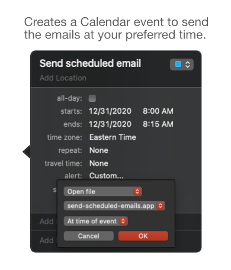

Here's a method that allows you to **write emails in Mail** and send them later, tackling Mail's age-old problem of not being able to schedule emails. A popular approach to get around this to use *Automator* and *Calendar*, but that **requires the user to write the emails in Automator**, rather than drafting them using the *Mail* app itself. The method presented here overcomes that limitation. 

## The Steps Are ##

1. Write your emails and put them in a *Mail* mailbox

2. Create a *Calendar* event that sends those email at your preferred time

   1. Open the script [send-scheduled-emails.scpt](send-scheduled-emails.scpt) in your Mac's *Script Editor*
      1. Specify names of your **`mailbox`** and email **`account`**
      2. `File` > `Export` > `File Format`: `Application`, `Run-only` > `Save` (e.g., `send-scheduled-email.app`).
      

   2. Create a *Calendar* event for when to send the emails
      1. Use the settings `alert`: `Custom...` > `Open file`, `Other...` (pick the `app` you created above), and `At time of event`.  
       

## Developer
[Duen Horng (Polo) Chau](https://www.cc.gatech.edu/~dchau/).

## Attribution
Image credit: <a href="https://www.freepik.com/vectors/business">Business vector created by pch.vector - www.freepik.com</a>
